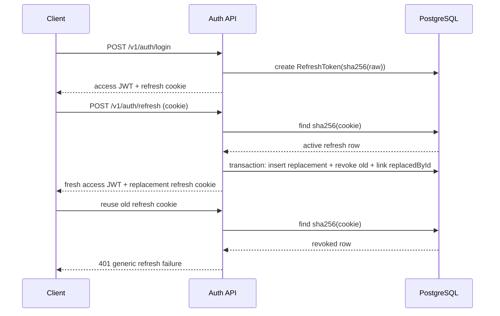

# Refresh-Token Rotation Flow

1. **Login issues a pair.** Return an HS256 access JWT with a 15-minute lifetime and claims `sub` + `role`. Generate the refresh token with `randomBytes(32)` encoded as base64url. Store only its SHA-256 hash in `RefreshToken`; send the raw value only in an `httpOnly`, `Secure`, `SameSite=strict` cookie scoped to `/v1/auth/refresh`.
2. **Refresh validates the presented token.** Hash the cookie value with SHA-256 and require that the database row exists, has not expired, and has `revokedAt = null`.
3. **Rotate atomically.** In one transaction, insert the replacement refresh-token row, set the old row's `revokedAt` and `replacedById`, issue a new access token, and set the new refresh cookie.
4. **Reuse is a theft signal.** A rotated/revoked token presented again returns the same generic `401` used for unknown and expired refresh tokens; do not expose which check failed.

